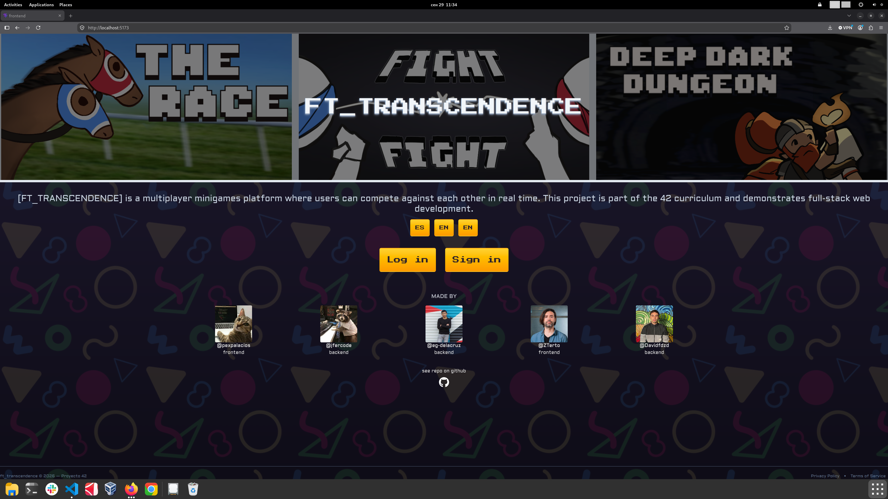
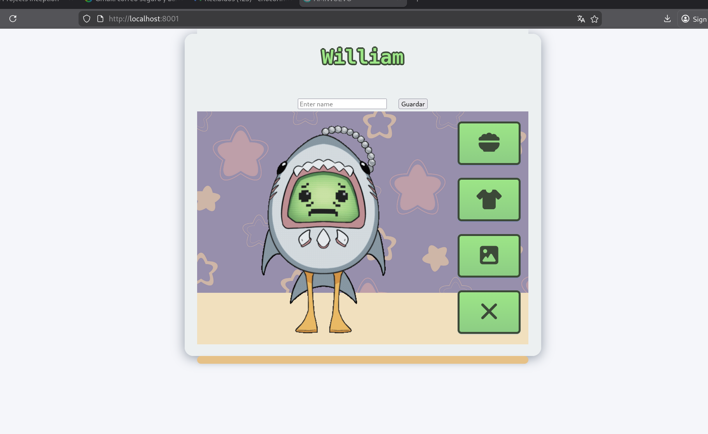
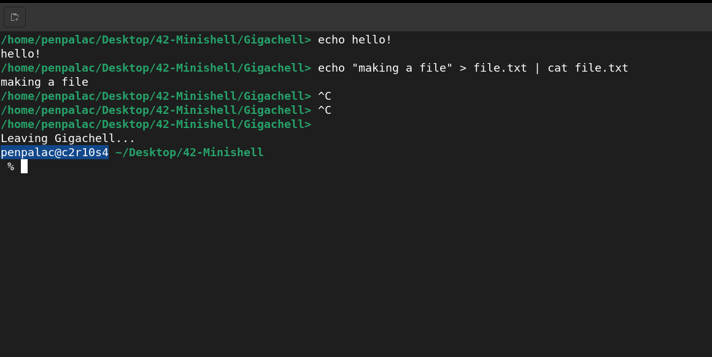
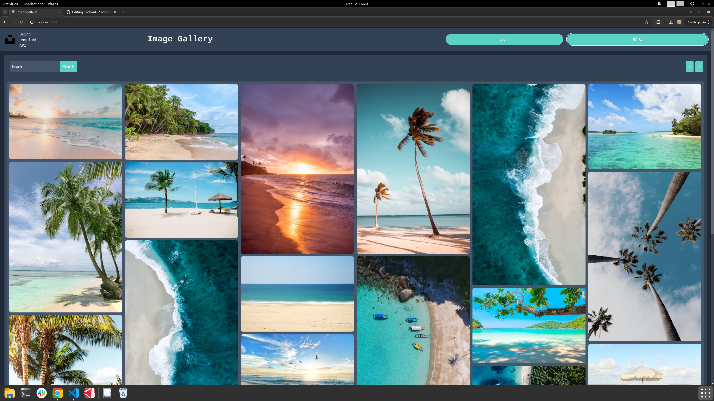

<h1 align="center">👋 Hello! I'm Pex</h1> 

 
  <b>Software & Web Developer · ES/EN</b>
    I like building things from the server to the screen. 

  
   
   
   
   
   
   
   

 <b>v Madrid Campus 42 Fundación Telefónica projects v</b>

## [Transcendence](https://github.com/eg-delacruz/42_ft_transcendence)
<table width="100%"> 
    <td  width="50%" valign="top"> 
      <ul> 
        <li>Minigame web project: play against others remotely</li> 
        <li>Three minigames to choose from</li> 
        <li>Real-time chat</li> 
        <li>User customization</li> 
        <li>Account system with secure password handling</li>
        <li>Database: MongoDB</li> 
        <li>Stack: Vite (React) + Express + TailwindCSS</li>
        <li>Uses docker</li>
      </ul> 
    </td> 
    <td width="50%" align="center">
       
    </td> 
</table>

## [Webserver](https://github.com/pexpalacios/Webserver)
<table> 
  <tr>
    <td width="50%" align="center">
      
    </td> 
    <td width="100%" valign="top"> 
      <ul> 
        <li>Local web server written from scratch</li> 
        <li>Project twist: a tamagotchi-like pet</li> 
        <li>Server in C++</li> 
        <li>Nginx as a reference/proxy</li> 
        <li>Front-end made with HTML and CSS</li> 
        <li>Dynamic content through CGIs</li> 
      </ul> 
    </td> 

  </tr> 
</table>

## [Minishell](https://github.com/jfercode/42-Minishell)
<table width="100%"> 
    <td  width="50%" valign="top"> 
      <ul> 
        <li>Bash console recreated completely in C</li>
        <li>Allows pipes and redirections</li>
        <li>Uses AST for structure</li>
        <li>Custom made commands: echo, cd, pwd, export, unset, env and exit</li>
      </ul> 
    </td> 
    <td width="50%" align="center">
       
    </td> 
</table>

## [Image gallery](https://github.com/pexpalacios/Globant-Piscine-FullStack---ImageGallery)
<table> 
  <tr>
    <td width="50%" align="center">
      
    </td> 
    <td width="100%" valign="top"> 
      <ul> 
        <li>Gallery website made with Unsplash API</li>
        <li>Uses OAuth to connect to you Unsplash profile</li>
        <li>Filter images by keywords</li>
        <li>Light and dark modes</li>
        <li>Responsive: looks good on pc and mobile</li>
        <li>Stack: Vite (React) + TailwindCSS</li>
        <li>Uses docker</li>
      </ul> 
    </td> 

  </tr> 
</table>
